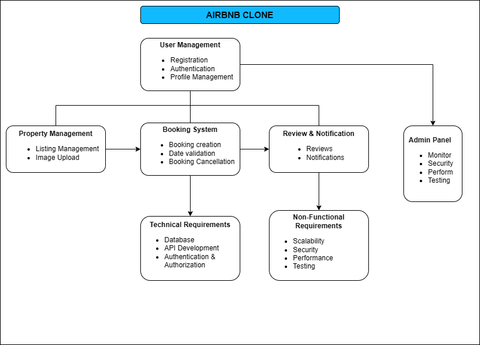

# Airbnb Clone – Backend Features and Functionalities

---

## 🏗️ Overview

The backend of the Airbnb Clone powers the entire application by managing user authentication, data storage, bookings, payments, and communication between clients and hosts.
This document outlines the **core**, **technical**, and **non-functional** requirements that define the backend system.

---

## 1. Core Functionalities
### 👤 User Management

    - **User Registration**: Sign up as guest or host.

    - **User Authentication**: Secure login using email/password and OAuth (Google, Facebook).

    - **Profile Management**: Update profile photo, contact info, and preferences.

### 🏠 Property Listings Management

    - **Add Listings**: Host creates property listings with title, description, location, price, amenities, and availability.

    - **Edit/Delete Listings**: Host can update or remove property listings.

    - **Image Upload**: Upload property images to file storage.

### 🔍 Search and Filtering

    - **Search Properties**: By location, price, number of guests, or amenities.

    - **Filtering**: Combine filters for refined results.

    - **Pagination**: Manage large datasets efficiently.

### 📅 Booking Management

    - **Create Bookings**: Guests can book available properties.

    - **Date Validation**: Prevent double bookings.

    - **Cancel Bookings**: Guests/Hosts can cancel.

    - **Booking Status Tracking**: Pending, confirmed, canceled, or completed.

### 💳 Payment Integration

    - **Payment Processing**: Guests make secure payments via Stripe/PayPal.

    - **Host Payouts**: Automated transfer after booking completion.

    - **Currency Support**: Handle multiple currencies.

### ⭐ Reviews and Ratings

    - **Post Reviews**: Guests rate and review properties.

    - **Host Response**: Hosts can reply to reviews.

    - **Validation**: Link reviews to actual bookings.

### 🔔 Notifications System

    - **Email Notifications**: Booking confirmations, payment updates, cancellations.

    - **In-App Alerts**: For hosts and guests.

### 🧑‍💼 Admin Dashboard

    - Monitor Users, Listings, Bookings, and Payments.

    - Manage Reports and Disputes.

---

## Airbnb Clone – Backend Features and Functionalities

This section outlines the key backend features and functionalities of the Airbnb Clone project.

### 🗂️ Backend Architecture Overview

---

## 2. Technical Requirements

| Category                           | Description                                                                                             |
| ---------------------------------- | ------------------------------------------------------------------------------------------------------- |
| **Database**                       | Use MySQL or PostgreSQL to store data (Users, Properties, Bookings, Reviews, Payments).                 |
| **API Development**                | Build RESTful APIs with proper HTTP methods (GET, POST, PUT, DELETE). Use GraphQL for advanced queries. |
| **Authentication & Authorization** | Use JWT for secure sessions; role-based access (Guest, Host, Admin).                                    |
| **File Storage**                   | Store images in cloud-based or local file storage.                                                      |
| **Third-Party Services**           | Integrate SendGrid or Mailgun for email notifications.                                                  |
| **Error Handling & Logging**       | Global error handler, structured logging for debugging.                                                 |

---

## 3. Non-Functional Requirements

| Requirement     | Description                                                     |
| --------------- | --------------------------------------------------------------- |
| **Scalability** | Modular and distributed architecture with load balancing.       |
| **Security**    | Encrypt passwords, secure APIs, and enforce rate limiting.      |
| **Performance** | Use caching (Redis), optimize DB queries.                       |
| **Testing**     | Unit and integration tests using Pytest; automated API testing. |

---

## 4. Visual Representation (Draw.io Diagram)

Your diagram should illustrate how all these features connect.
Use these suggested categories and layout in Draw.io:

**Nodes to Include:**

    - **User Management**

    - **Property Management**

    - **Booking System**

    - **Payment System**

    - **Review & Notification**

    - **Admin Panel**

    - **Database**

    - **API Gateway**

#### Connections Example:
    Users ↔ Authentication ↔ API ↔ Database
    Hosts ↔ Property Management ↔ Database
    Guests ↔ Booking System ↔ Payment Gateway ↔ Notifications
    Admin ↔ Dashboard ↔ Database ↔ Logs

