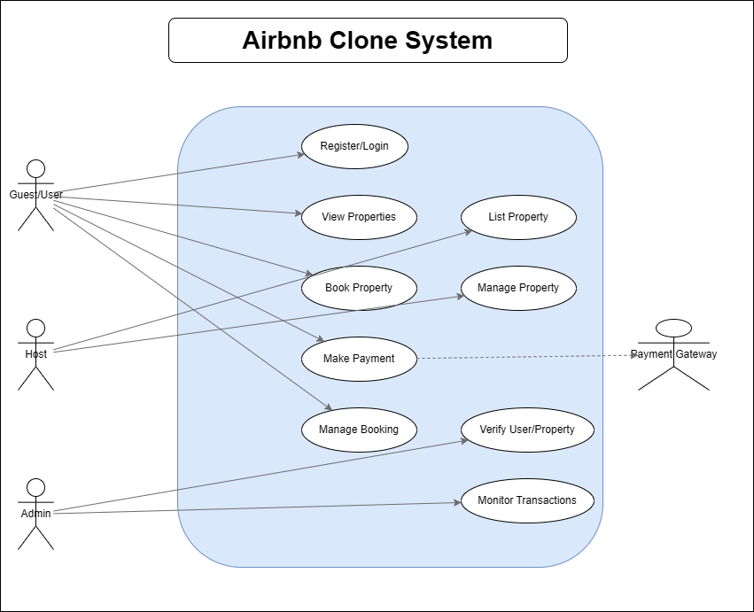

# Use Case Diagram – Airbnb Clone

This diagram illustrates the interactions between different system actors (User, Host, Admin, and Payment Gateway) and the Airbnb Clone system.

## 🎭 Actors
- **User:** Registers, searches, and books properties.
- **Host:** Lists and manages properties.
- **Admin:** Oversees user activities, verifies listings, and monitors transactions.
- **Payment Gateway:** Handles secure online payments.

## 🔁 System Use Cases
- User registration and login
- Property search and viewing
- Booking and payment management
- Host property listing and maintenance
- Admin verification and monitoring

### 📘 Diagram

---

## 🧠 Use Case Diagram Plan
### Actors

- **User** (Guest)

- **Host**

- **Admin**

- **Payment Gateway**

### Use Cases

- **User Registration/Login**

- **View Properties**

- **Book Property**

- **Make Payment**

- **Manage Booking**

- **List Property** (Host)

- **Manage Property** (Host)

- **Verify User/Property** (Admin)

- **Monitor Transactions** (Admin)

---

## 🧰 File Organization

Create this directory structure:

alx-airbnb-project-documentation/
│

├── use-case-diagram/

│   ├── README.md

│   └── airbnb-use-case-diagram.png

---